<div align="center">


# Glimmerwood

### The web browser that's on your side.

A quiet browser for Linux, macOS and Windows, and home to the wisp: a small
living companion who notices how your time online really feels, so you can
spend more of it on the things that leave you better off.

[**Download**](https://github.com/peterwalker78/glimmerwood/releases/latest) ·
[Getting it](#start-today) ·
[Meet the wisp](#meet-the-wisp) ·
[On your phone](#and-on-your-phone) ·
[How it works](#how-it-works-in-plain-words) ·
[Privacy](#everything-stays-on-your-computer)

<br>

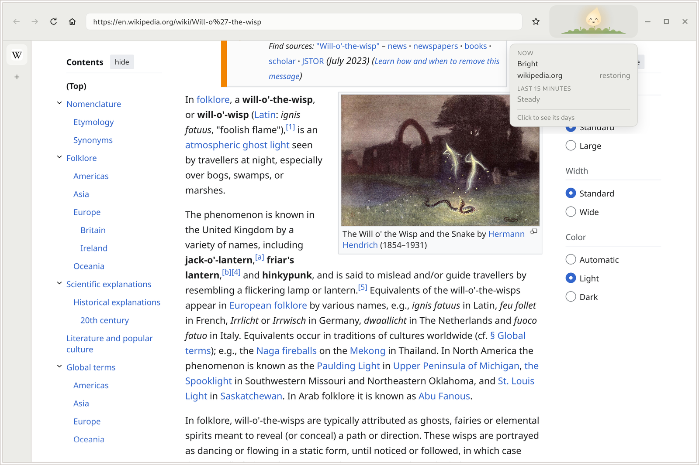

</div>

<br>

## You know the feeling

You open the laptop to check one thing. You look up and an hour has gone.
You can't remember much of what you saw, and you feel a little flatter than
when you started.

**That isn't a lack of willpower.** Some of the biggest sites on the web are
designed, tested and tuned by very large teams to keep you scrolling. Every
other browser treats that hour exactly the same as an hour spent learning
something, reading something beautiful or talking to someone you love.

Glimmerwood doesn't. It's a browser built around a simple idea: **you can't change
what you can't see.** So Glimmerwood helps you see it, gently, while you browse,
and then gets out of your way.

<br>

## Meet the wisp

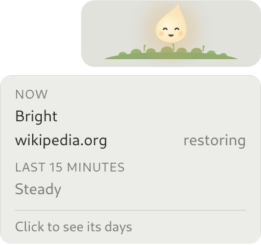

Glimmerwood is home to the wisp, a small, glowing flame with a face who lives
up in the corner of the toolbar.
It's yours, and it reflects the quality of your time online the way the sky
reflects the weather.

Spend time somewhere that restores you and it brightens, closes its eyes
happily and lets off little motes of light. Sink into an endless feed and it
slowly clouds over, grows tired and drifts toward the edge of its nook, as if
it's ready to go outside and hoping you'll come too.

**Its eyebrows do most of the talking.** They only ever move up or down, never
tilting into sad or stern, so its mood reads from across the room rather than
only up close. Behind it, the nook takes on the weather of your day: fresh and
green while you're recovering, a dusky haze while it wears. Never red, never
an alarm.

**It never scolds you.** At its heaviest it looks sleepy, never sad or cross.
Step away for a while and it perks up again. Hover over it any time and it
tells you, in plain words, exactly what's moving it.

<br clear="right">

<table>
  <tr>
    <td align="center">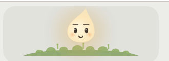<br><b>Bright</b><br><sub>rested and ready</sub></td>
    <td align="center">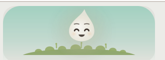<br><b>Happy</b><br><sub>somewhere that restores you</sub></td>
    <td align="center">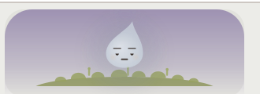<br><b>Clouded</b><br><sub>a long scroll is weighing on it</sub></td>
  </tr>
  <tr>
    <td align="center">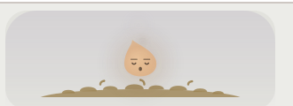<br><b>Sleepy</b><br><sub>time for a breather</sub></td>
    <td align="center">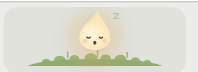<br><b>Dozing</b><br><sub>you're away, and it's resting too</sub></td>
    <td align="center">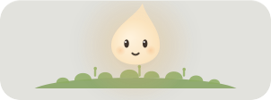<br><b>Winding down</b><br><sub>late at night, with you</sub></td>
  </tr>
</table>

Even its moss follows along: fresh and green when things are good, dry and
tan after a heavy stretch, and green again as soon as you rest. Nothing about
the wisp ever dies or disappears for good.

<br>

## And on your phone

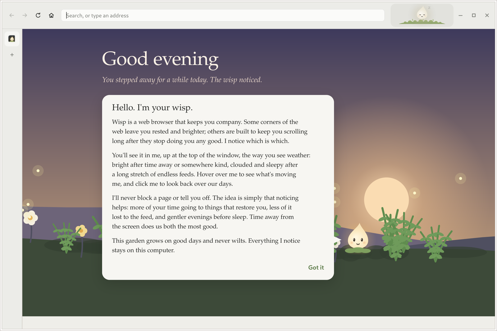

The wisp lives on your computer. It can't come to your phone — on iOS every
browser is the same engine underneath, and a phone is the one place you can't
really sit down with the web anyway.

So there's a page instead: **[glimmerwood on the web](https://peterwalker78.github.io/glimmerwood/)**.
The same garden, lit for the hour, and good places drawn from the same
researched list. The wisp is there too, asleep — it has no history to read
here and stores nothing at all, so it doesn't pretend to see anything.

Add it to your home screen, where a noisier app used to be, and it opens on
its own without a browser around it. Then do the real browsing at a desk,
somewhere you can stand up and leave.

<br clear="right">

## Why a little light works better than a lock

Most tools for "digital wellbeing" lean on blocking, timers and guilt. They
work for a week, then you find the switch that turns them off, because nobody
likes being told what to do.

Glimmerwood is built on what tends to stick instead:

- 🪞 **Noticing, not nagging.** Just keeping track of how you use the web has
  been found to leave people less anxious and less afraid of missing out. The
  wisp does the noticing for you, so the choice stays yours.
- 🌱 **Kindness over shame.** Guilt makes people hide from the problem;
  self-compassion makes it easier to change. Glimmerwood celebrates good days out
  loud and never lectures you about the rest.
- 🚪 **You're always in charge.** Glimmerwood never blocks a page, never pops up a
  warning, never makes you prove anything. Every site stays one click away.
- ☀️ **Time away counts the most.** The best thing for your wisp isn't a
  "good" website: it's closing the laptop. Glimmerwood is probably the only browser
  that's happiest when you're not using it.
- 🌙 **Your evenings matter.** Screens late at night are one of the clearest
  links between life online and poor sleep, so after 11pm the wisp winds down
  with you.

<br>

## A home that grows with you

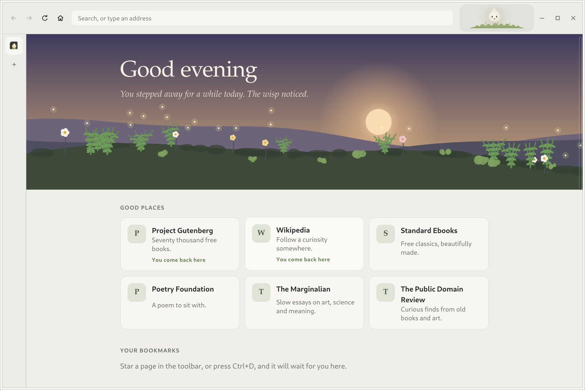

Every new tab opens **Home**, a calm page made on your computer rather than
fetched from anywhere.

- **A garden that grows on good days.** A quiet day brings moss, a day of
  learning brings ferns, a gentle day brings flowers, and a calm night leaves
  fireflies. A heavy day simply grows nothing. **Nothing ever wilts, and
  missing a day costs you nothing:** there are no streaks to break.
- **A sky that follows the real sun.** Morning, day, evening and night arrive
  when they actually do where you are, rather than when a clock says so.
- **A greeting that notices what went well.** "You took a proper break
  earlier." "Last night stayed calm after dark." Only ever true, and never
  about what went badly.
- **Good places.** Instead of a grid of the sites you visit most (the ones you
  least need reminding of), Home offers somewhere worth going: the good
  places you already return to, and fresh suggestions every couple of hours
  from over 300 researched corners of the web that leave people better off:
  live nature cams and the night sky, poetry and free books, museums, music,
  making, gentle puzzles, kind news, and ways to give or get outside. They fit
  the time of day and the season, never repeat what you saw earlier today,
  and lean toward calm when the wisp is tired.
- **Your bookmarks,** kept on your computer.

The first time you open Home, the wisp introduces itself:


<br>

## See your days, not a scoreboard

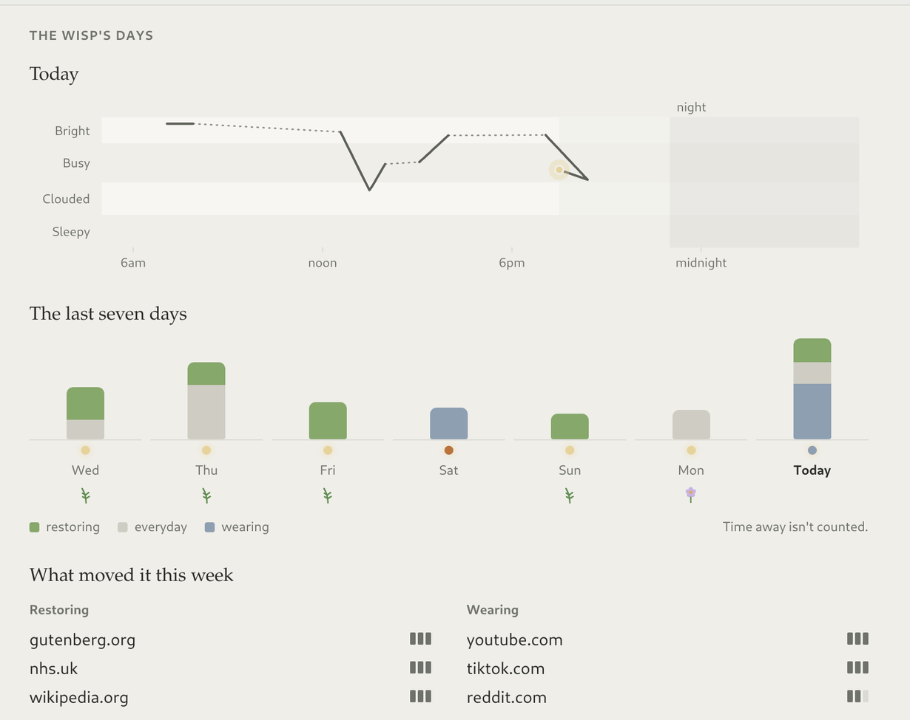

Click the wisp and it shows you its days: how today has felt, hour by hour,
the shape of your last week, and which places restored you or wore you down.

There are **no minutes, scores or percentages** anywhere. Days are only
compared with each other, so you see the pattern without a number to feel
bad about.

It's the kind of mirror that makes the next choice easier: *oh, Thursday
evenings are always like that.*

<br clear="right">

<br>

## Start today

Glimmerwood is free and open source. Install it, make it your default browser, and
then just use the web as you normally would. There's nothing to set up and
nothing to learn: the wisp starts noticing straight away, and your garden can
grow its first plant tomorrow.

**Install the Flatpak** (x86_64 Linux, needs [Flathub](https://flathub.org/setup)
for the GNOME runtime):

```sh
curl -LO https://github.com/peterwalker78/glimmerwood/releases/latest/download/glimmerwood-x86_64.flatpak
flatpak install --user glimmerwood-x86_64.flatpak
```

Then open **Glimmerwood** from your applications. To make it your default browser,
choose it under *Default Applications* in your desktop's settings.

> **Glimmerwood was called Wisp** in its first release, until we found another
> browser already had the name. Version 0.2.0 has a new app ID, so it installs
> beside Wisp rather than replacing it: remove the old one with
> `flatpak uninstall --user io.github.peterwalker78.Wisp`.

> Glimmerwood is young. It's already a comfortable everyday browser for most of the
> web, and it's growing quickly. If something doesn't work, please
> [open an issue](https://github.com/peterwalker78/glimmerwood/issues).

### Windows and macOS

Both are on the [releases page](https://github.com/peterwalker78/glimmerwood/releases/latest)
beside the Flatpak, on the same core as the Linux build: tabs, bookmarks, find
in page, zoom, Home, Settings, the keyboard, and the wisp in its nook watching
over them. One difference worth knowing: on macOS, WebKit reports a page's
sound only through a private property, so a tab playing quietly there doesn't
keep the wisp awake the way it does elsewhere.

**Windows** — unzip `glimmerwood-windows-x64.zip` and run `Glimmerwood.exe`,
keeping it beside `WebView2Loader.dll`. It needs the WebView2 runtime, which
Windows 11 and current Windows 10 already have; if a machine hasn't got it, the
app says so. Unsigned, so SmartScreen warns once: *More info*, then *Run anyway*.

**macOS** — unzip `glimmerwood-macos.zip` and drag **Glimmerwood** to
Applications. macOS 11 or later, Apple silicon or Intel. Unsigned, so Gatekeeper
refuses a double-click: right-click the app and choose **Open**, or clear the
flag first.

```sh
xattr -dr com.apple.quarantine /Applications/Glimmerwood.app
```


<br>

## Everything stays on your computer

A browser that watches how you feel online has to be trustworthy, so Glimmerwood is
private by design, not by promise:

- **Nothing about you ever leaves your computer.** No accounts, no telemetry,
  no update pings, no cloud. The only network traffic is the pages you choose
  to visit.
- **It never records the pages you visit.** Its history keeps only which
  *kind* of place you were on (say, "reddit.com, on the wearing list"), never
  the address, what you read or what you typed.
- **Private sites stay private.** On adult sites the wisp closes its eyes,
  turns away and gives you privacy. Nothing about those visits is named.
- **Built-in tracking protection** runs on your machine, and HTTPS is tried
  first for every site.

<br>

## How it works, in plain words

### The dose

Behind the wisp is a single number between 0 and 1, called the **dose**. Think
of it as how heavy the wisp feels. It rises while you're on draining sites and
falls while you rest, and the wisp's look follows it: bright below 0.2, busy
up to 0.5, clouded up to 0.75, and sleepy beyond.

- **On a draining site** it climbs steadily. A long unbroken session reaches
  sleepy in about 50 minutes.
- **Short visits cost less than long sessions.** The first ten minutes count
  half, and after half an hour each minute counts a little more. A five-minute
  break starts you fresh.
- **Away from the screen** it halves every 25 minutes. This is the fastest
  way to recover, on purpose.
- **On a restorative site** it recovers too, just more slowly than being away.
  Everyday sites (your bank, your email, a map) recover it more slowly still.
- **Late at night** (11pm to 5am, or your own hours in Settings) draining time
  counts one and a half times, and everyday sites stop counting as rest.
- **A new day** starts fresh at 5am, carrying over at most a little of a very
  heavy yesterday.

Glimmerwood only counts time you're actually there: if you haven't touched the
keyboard or mouse for four minutes, it treats you as away (unless you're
watching a video).

### The lists

How a site affects the dose depends on which list it's on. Glimmerwood comes with
about 8,000 sites already sorted, based on published research into wellbeing
online: the 10,000 most-visited sites on the web, checked one by one, plus long
lists of gambling and adult sites. The studies behind each group are cited in
[`core/data/reputation.toml`](core/data/reputation.toml).

| List | Weight | Examples |
|---|---|---|
| Draining, strong | −1 | endless short-video feeds, gambling |
| Draining, mild | −0.4 | dating and trading apps, clickbait, gossip |
| News | −0.4 | news sites; the first 15 minutes each day count half |
| Everyday | 0 | banking, government, health services, maps, shops |
| Restoring, mild | +0.5 | reference, learning, making, the arts, puzzles |
| Restoring, strong | +1 | meditation, books and reading, live nature cams |

A site on no list simply holds the wisp steady. Where the research was mixed,
a site went on the milder list.

Everyone is different, so the lists are yours to change. Spend a little while
on a site the wisp hasn't met and it asks, once, how the place leaves you,
with a slider from *drains me* to *restores me*. Only you see the answer; it's
there so the wisp can look after you honestly. Every rating can be changed
later in **Settings** (Ctrl+comma, or the link at the foot of Home), where you
can also look up and rate any site. Ratings are kept in your own
`reputation.toml` (the same list names as the bundled file, such as
`draining-mild` or `nourishing-strong`) in `~/.config/glimmerwood/` (or
`~/.var/app/io.github.peterwalker78.Glimmerwood/config/glimmerwood/` for the
Flatpak), which you can edit by hand too. Changes take effect immediately.

### The everyday things

Downloads land in your Downloads folder with a quiet mark in the toolbar
while they arrive. The tabs you left open come back **asleep** — a row in the
column holding its title, loading nothing until you ask for it. Home keeps a
week of where you've been, and no longer, with private-list sites never
written down at all.

There is **no completion as you type**, and there isn't going to be: the
pages such a list offers hardest are the ones already visited most. Ctrl or
Cmd with Enter turns a bare word into its `.com`.

And there's a way back out of a stretch you didn't mean to spend: forget the
last 15 minutes, half hour, hour or two. It takes those pages, the finished
downloads, and the sites out of the wisp's memory of that stretch. How the
time felt stays — the wisp is only worth having if that part is true.

### A few more things it notices

- **Sound counts as watching.** A tab playing in front of you keeps the wisp
  awake for up to half an hour after you last touched anything, so falling
  asleep to rain sounds is rest, not screen time. Tabs you aren't looking at
  never count, however many you have open.
- **Coming back after two hours away,** the wisp greets you visibly brighter.

<br>

## On the way

- A short **daily read** in the garden: something good, then done. No feed.
- Rare, gentle **whispers** from the wisp at natural stopping points, never
  mid-flow and never more than twice a day.
- An optional **pause at the door** for sites *you* choose, with two equal
  buttons: go in, or not now.
- **Sleeping tabs**, freeing what an hour of being unseen doesn't need.
- **Permission requests** for camera, mic and location, quietly inline.
  Notifications are always denied: they exist to pull you back.
- **Full-screen video** that hides the chrome, and `file://` pages.

Have a site you think is on the wrong list? That's exactly the kind of help
Glimmerwood needs: please [open an issue](https://github.com/peterwalker78/glimmerwood/issues)
and say why.

<br>

## For developers

Glimmerwood is written in Rust, on the engine each system already has: GTK 4
and WebKitGTK 6.0 on Linux, WebKit on macOS, the Edge WebView2 runtime on
Windows. Nothing is bundled anywhere. The wisp itself is drawn natively rather
than in a web page, so the whole browser idles at around one percent of a CPU
core with the wisp breathing. The toolbar and Home are small TypeScript pages
compiled by the native TypeScript 7 compiler, so there's no Node in the build.

The workspace splits the browser from the machine it runs on. `core/` is the
dose model, the lists, the garden, the diary, the tabs, the protocol and the
whole of the wisp's drawing, with no window toolkit anywhere in its
dependencies; `app/`, `macos/` and `windows/` are the three shells on top of
it, each holding only what its own system does differently. `raster/` draws
the wisp into pixels where there is no cairo.

Requirements: Rust (stable), GTK 4.20 or later, WebKitGTK 6.0,
`glib-compile-resources`, SQLite, and `curl` to fetch the compiler.

```sh
scripts/dev      # build and run from the source tree
scripts/check    # formatting, clippy, tests and the TypeScript build
scripts/flatpak  # build and install the Flatpak for your user
scripts/bundle   # build a single-file Flatpak bundle for release
scripts/site     # build the welcome page; --publish puts it online
```

If a distrobox named `glimmerwood` exists, `scripts/dev` and `scripts/check` run
inside it. `scripts/flatpak` and `scripts/bundle` need Flathub's
`org.flatpak.Builder`.

`glimmerwood --feel-lab` plays a scripted day at high speed, so you can watch the
wisp's moods without living through a day of browsing (`--from=HH:MM`,
`--speed=N`).

AI coding tools are used in writing Glimmerwood's code.

## Licence

Glimmerwood is free software under the GNU General Public License, version 3 or
later. See [`COPYING`](COPYING).

The gambling and adult lists in [`core/data/imported/`](core/data/imported) are
drawn from the [Université Toulouse Capitole blacklists](https://dsi.ut-capitole.fr/blacklists/)
and are available under [CC BY-SA 4.0](https://creativecommons.org/licenses/by-sa/4.0/).
